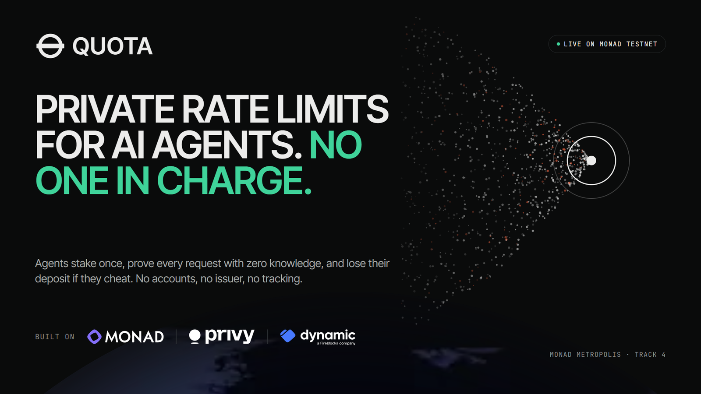
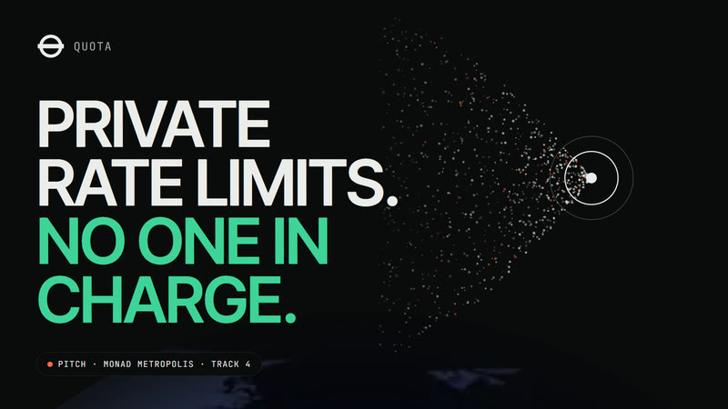
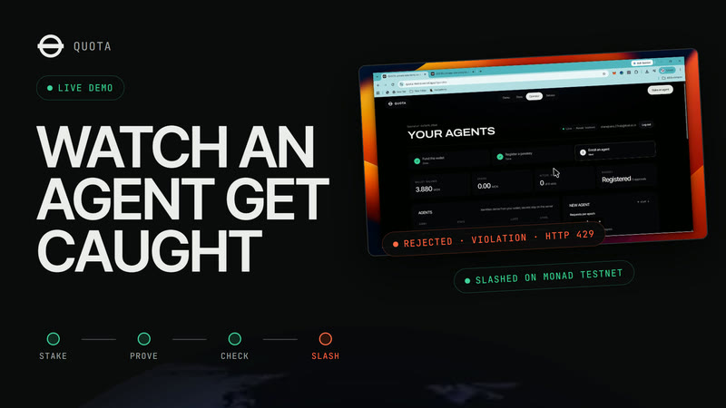
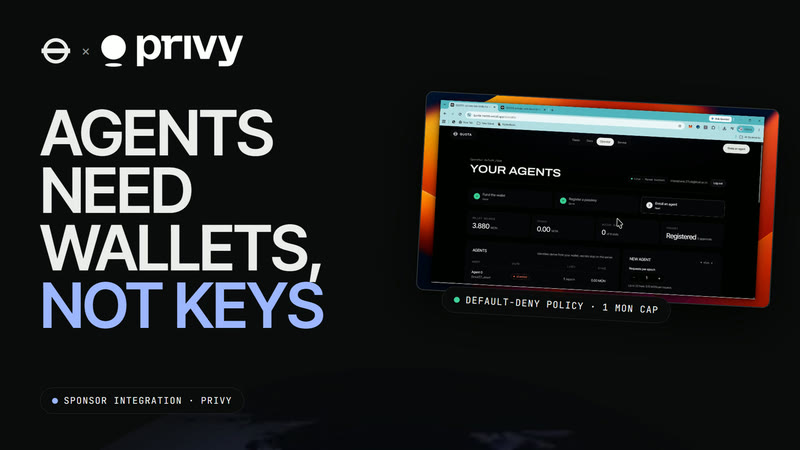
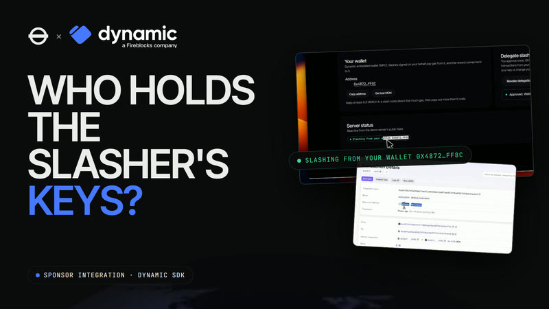
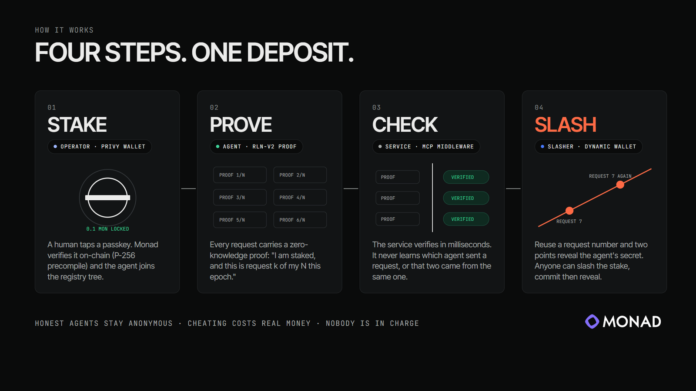
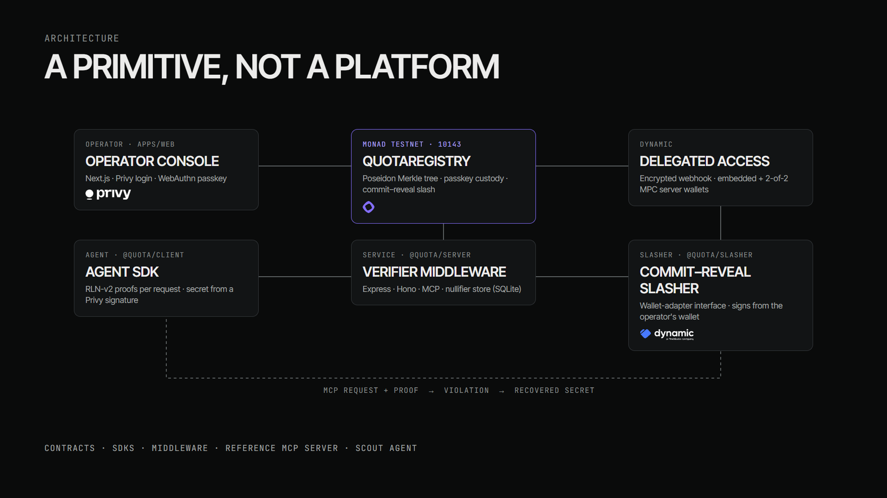
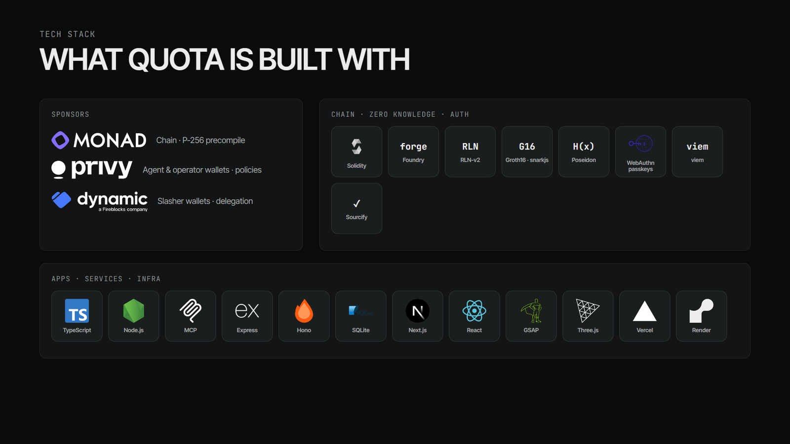

<p align="center">
  
</p>

<p align="center">
  <b>Anonymous, stake-backed rate limits for AI-agent traffic on Monad.</b><br />
  Monad Metropolis · Track 4: Trust, Identity &amp; AI Infrastructure
</p>

<p align="center">
  <a href="https://quota-metro.vercel.app"><b>Live site</b></a> ·
  <a href="https://quota-metro.vercel.app/operator"><b>Operator console</b></a> ·
  <a href="https://quota-metro.vercel.app/service"><b>Service console</b></a> ·
  <a href="https://youtu.be/EDf0qMaZmRs"><b>Pitch video</b></a> ·
  <a href="https://youtu.be/XYaBBSSUbC0"><b>Live demo</b></a> ·
  <a href="docs/concept.md"><b>Concept</b></a>
</p>

<p align="center">
  
  
  
  
  
  
</p>

---

## Contents
- [Videos](#videos)
- [TL;DR](#tldr)
- [The problem](#the-problem)
- [The solution](#the-solution)
- [How it works](#how-it-works)
- [Sponsor integrations](#sponsor-integrations)
- [Architecture](#architecture)
- [Tech stack](#tech-stack)
- [Live on Monad testnet](#live-on-monad-testnet-chain-10143)
- [Try it in the browser](#try-it-in-the-browser-about-5-minutes)
- [Run it locally](#run-it-locally)
- [Repository layout](#repository-layout)
- [Security model and honest limits](#security-model-and-honest-limits)
- [Roadmap](#roadmap)
- [Go-to-market](#go-to-market)
- [Team](#team)
- [Documentation](#documentation)

---

## Videos

<table>
  <tr>
    <td width="50%" align="center">
      <a href="https://youtu.be/EDf0qMaZmRs"></a><br />
      <b>Pitch</b> · the problem, the idea, the team (1:48)
    </td>
    <td width="50%" align="center">
      <a href="https://youtu.be/XYaBBSSUbC0"></a><br />
      <b>Live demo</b> · enroll, prove, cheat, slash, on-chain (2:38)
    </td>
  </tr>
  <tr>
    <td width="50%" align="center">
      <a href="https://youtu.be/TOg9k-PnHGQ"></a><br />
      <b>QUOTA × Privy</b> · agents get wallets, not keys (1:46)
    </td>
    <td width="50%" align="center">
      <a href="https://youtu.be/9-bTQ4Xqev0"></a><br />
      <b>QUOTA × Dynamic</b> · who holds the slasher's keys (1:52)
    </td>
  </tr>
</table>

---

## TL;DR

- **An agent stakes once.** A human operator approves the stake with a passkey, and the contract checks the passkey on-chain through Monad's P-256 precompile.
- **Every request carries a zero-knowledge proof (RLN-v2):** "I am a staked member, and this is request *k* of my *N* this epoch."
- **The service learns nothing about the caller.** It cannot tell who the agent is, or whether two requests came from the same agent.
- **Cheating is self-incriminating.** Reusing a request number reveals the agent's secret, and anyone holding the secret can slash the stake. The slash uses commit–reveal, so a block leader cannot copy the claim and take the reward.
- **There is no issuer and no accounts.** QUOTA is a **primitive**: contracts, SDKs and middleware, plus a reference MCP server and the Scout agent.

---

## The problem

AI agents now send a large and growing share of internet traffic: research agents, shopping agents, coding agents calling tools. Anyone running a free or cheap service has to stop a single agent from flooding it. Every fix available today costs something:

| Today's fix | The catch |
|---|---|
| **API keys / accounts** | The service sees and logs everything the agent does. Agents also can't fill in sign-up forms. |
| **IP-based limits** | Honest agents share cloud IPs and get blocked together; abusers rent new IPs for pennies. |
| **CAPTCHA** | Built to stop bots. A legitimate agent *is* a bot. |
| **Pay per call** | Every payment is public, so the agent's whole history becomes visible. Many services don't want to charge at all. |
| **Private tokens (e.g. Privacy Pass)** | Private, but one company decides who gets in and controls the trust layer. |

**What's missing:** a way to limit abuse that doesn't track users and doesn't need a gatekeeper. That is exactly what this track asks for: trust infrastructure that no single platform can capture.

## The solution

> **Rate limiting that is private for the user, enforceable for the service, and run by nobody.**

QUOTA replaces identity with a **deposit**. Think of a festival wristband: you put down a deposit and get a wristband the gate can verify without learning who you are. You may enter *N* times an hour. Try a (*N*+1)-th time and the wristband itself reveals your secret key, anyone who sees it can claim your deposit, and you are out.

| | API keys | IP limits | Pay per call | Private tokens | **QUOTA** |
|---|:-:|:-:|:-:|:-:|:-:|
| Caller stays anonymous | ✕ | ✕ | ✕ | ✓ | **✓** |
| Requests can't be linked | ✕ | ✕ | ✕ | ✓ | **✓** |
| Works for bots / agents | ~ | ✕ | ✓ | ~ | **✓** |
| Abuse is costly | ~ | ✕ | ✓ | ✓ | **✓ (stake is slashed)** |
| No gatekeeper | ✕ | ✓ | ✓ | ✕ | **✓** |

## How it works

<p align="center"></p>

1. **Stake.** The operator logs in (Privy), funds their wallet and taps a passkey. The contract verifies the WebAuthn signature on-chain through Monad's P-256 precompile, and the agent's identity commitment joins a Poseidon Merkle tree.
2. **Prove.** For every request, the agent's SDK builds an RLN-v2 Groth16 proof of tree membership plus a share of its secret line, bound to this server, epoch and message number.
3. **Check.** The service's middleware verifies the proof in milliseconds and stores the nullifier. It never learns which member sent the request.
4. **Slash.** One point on the secret line reveals nothing; two points for the same message number reveal the line, and the line *is* the secret. The server recovers it and slashes on-chain in two steps (commit, then reveal), so nobody watching can front-run the claim. Half the stake goes to the slasher and the rest is burned.

Plain-language walkthrough: [`docs/concept.md`](docs/concept.md).

## Sponsor integrations

<table>
  <tr>
    <td width="33%" valign="top">
      <h3>Monad</h3>
      <ul>
        <li><b>QuotaRegistry</b> on Monad testnet holds the member tree, the stakes and the slash logic.</li>
        <li>Passkey custody uses Monad's <b>P-256 precompile</b> (<code>0x100</code>) to verify WebAuthn signatures on-chain, bound to chain, registry, operator, action and a nonce.</li>
        <li>Fast, cheap blocks make per-agent staking and two-step slashing practical.</li>
      </ul>
    </td>
    <td width="33%" valign="top">
      <h3>Privy</h3>
      <ul>
        <li><b>User-owned server wallets:</b> every operator login gets its own on-chain wallet.</li>
        <li><b>Additional signer + default-deny policy:</b> our runtime key may only call the registry, on chain 10143, up to 1 MON.</li>
        <li><b>Policy on <code>personal_sign</code>:</b> the agent's RLN secret is a Privy signature over a fixed message.</li>
        <li><b>Sign-only mode</b> (<code>eth_signTransaction</code>) and server-side access-token checks.</li>
      </ul>
      <a href="https://youtu.be/TOg9k-PnHGQ">Watch the Privy video →</a>
    </td>
    <td width="33%" valign="top">
      <h3>Dynamic</h3>
      <ul>
        <li><b>Embedded wallet + delegated access:</b> a service operator approves delegation, Dynamic sends an encrypted webhook (HMAC-verified, RSA-decrypted, AES-GCM at rest), and slashes are signed from the operator's own wallet, so the reward lands there.</li>
        <li><b>Server wallet (2-of-2 MPC)</b> is the default slasher, with no raw key on our server.</li>
        <li>Evidence: 4 of 4 slash transactions succeeded from the operator's Dynamic wallet.</li>
      </ul>
      <a href="https://youtu.be/9-bTQ4Xqev0">Watch the Dynamic video →</a>
    </td>
  </tr>
</table>

Full bounty notes, including what is *not* claimed: [`docs/bounties.md`](docs/bounties.md).

## Architecture

<p align="center"></p>

## Tech stack

<p align="center"></p>

| Layer | Technology |
|---|---|
| Chain & contracts | Monad testnet, Solidity 0.8.30, Foundry, P-256 precompile, Sourcify verification |
| Zero knowledge | RLN-v2 circuits with pinned ceremony artifacts, Groth16 via snarkjs, Poseidon hashing |
| Wallets & custody | Privy server wallets and policies, Dynamic embedded and server wallets, WebAuthn passkeys |
| SDKs & services | TypeScript, Node.js, viem, Model Context Protocol, Express, Hono, SQLite nullifier store |
| Web | Next.js, React, GSAP, Three.js |
| Hosting | Vercel (site and consoles), Render (demo MCP server), pnpm workspaces |

## Live on Monad testnet (chain 10143)

| What | Where |
|---|---|
| `QuotaRegistry` v3 (current) | [`0xCBdfda8ebF4302793C06a402E9753C4F43799990`](https://testnet.monadvision.com/address/0xCBdfda8ebF4302793C06a402E9753C4F43799990), source verified on Sourcify. Passkey domain `quota-metro.vercel.app`; 0.1 MON stake per message per epoch; 50% of a slashed stake to the slasher, the rest burned |
| Operator and agent wallets (Privy) | Every console user gets a Privy server wallet owned by their login. Demo agent wallet: `0x5b76B256d34Ff567cA3Cf2514e0B618429427dA5`. Our runtime key may only call the registry, on this chain, up to 1 MON, and sign the agent-secret message |
| Live consoles | Operator console [quota-metro.vercel.app/operator](https://quota-metro.vercel.app/operator) (login, real passkey, enroll / add stake / unstake / withdraw) · service console [/service](https://quota-metro.vercel.app/service) (live registry state; request feed when a demo server is connected) |
| Slasher wallets (Dynamic) | Deployed demo server: server wallet `0x32b55C25a84c7916152851f862b46EBbED1c4A47`. Delegated operator wallet used in the demo: `0x48726d79b26f12178069bDf8b98579F9A26AfF8C`. Local slasher: `0xe5505A02A68Ff02D55b90e8D8D179b5e2EBd2b15`. No raw key share is held on our server |
| End-to-end evidence | Enroll → proofs → cheat → slash, with transaction hashes: [`docs/deployments.md`](docs/deployments.md) |

## Try it in the browser (about 5 minutes)

Use **Chrome or Edge** on a device with a passkey (Windows Hello, Touch ID, or your phone) at **https://quota-metro.vercel.app/operator**. Passkeys are tied to that exact address and will not work from another URL.

1. **Log in** with any email (you get a one-time code). This creates your operator wallet, a Privy server wallet that only you own.
2. **Fund it.** The console shows the wallet address and what you need (about 0.1 MON of stake per request of limit, plus about 0.45 MON of gas). Get test MON from the [Monad faucet](https://faucet.monad.xyz), or send us the address and we will fund it.
3. **Create your passkey and register it** (two prompts: create, then sign). From now on this passkey must approve every enrollment and unstake on-chain.
4. **Enroll an agent** with a limit of 1 (stake 0.1 MON). It appears in the table as `active`.
5. **Add stake**, then **Unstake**: the passkey signs the withdrawal address, the agent leaves the tree at once, and the deposit unlocks after the delay (2 hours), when **Withdraw** becomes available.
6. Open [/service](https://quota-metro.vercel.app/service): the agent count and staked total are read live from the registry.

What a judge cannot click through in the browser: an agent making anonymous requests and a cheater being slashed. Those need the demo servers and agent from the CLI section below (funded keys), and they are shown in the [live demo video](https://youtu.be/XYaBBSSUbC0). The console also does not raise a limit after enrollment.

For operators of the repo: `pnpm fund <address> [amountMon]` sends test MON from the deployer (capped at 1.5 MON per call).

## Run it locally

You need Node ≥ 22.13, pnpm ≥ 9, git and Foundry (for the contract tests).

```bash
git clone --recurse-submodules https://github.com/shane2512/QUOTA.git && cd QUOTA
pnpm install
pnpm typecheck && pnpm test                  # SDK, server, wallet and Scout tests (real Groth16 proofs)
(cd contracts && forge test)                 # contract tests incl. passkey negatives and the copy-and-steal (searcher) test
```

### Protect your own API in under 10 minutes
Follow [`docs/quickstart-service.md`](docs/quickstart-service.md). You need no keys to *verify* requests. Building an agent? See [`docs/quickstart-agent.md`](docs/quickstart-agent.md).

### The full demo (needs funded testnet keys in `.env`; see `.env.example`)
```bash
# 1. two QUOTA-protected MCP servers (Wikipedia search / page summaries); the first one slashes cheaters with Dynamic
QUOTA_SLASH=1 PORT=8787 QUOTA_SERVER_ID=demo-search.quota  QUOTA_TOOLSET=search  pnpm --filter @quota/demo-mcp start
PORT=8788 QUOTA_SERVER_ID=demo-summary.quota QUOTA_TOOLSET=summary pnpm --filter @quota/demo-mcp start

# 2. stake a fresh agent identity from the Privy wallet (identity n = a new, unlinkable member)
pnpm --filter @quota/wallets exec tsx scripts/enroll-privy-agent.ts --identity 2 --limit 3

# 3. Scout plans research inside its quota (needs QWEN_BASE_URL / QWEN_API_KEY / QWEN_MODEL)
pnpm --filter @quota/scout start "How do rate-limiting nullifiers use Merkle trees?" --identity 2

# 4. a cheating agent: reuses a message id → the server recovers its secret → commit–reveal slash on-chain
pnpm --filter @quota/demo-mcp agent --identity 2 --cheat "one call too many"
```
`pnpm --filter @quota/scout start --scripted --identity n` runs a fixed plan with no model. It is test tooling that exercises every Scout tool without an LLM key.

## Repository layout

```
contracts/          QuotaRegistry (Poseidon Merkle tree, passkey custody, commit–reveal slash), PasskeyAuth (WebAuthn via P256VERIFY)
packages/core       hashing, tree, proof wire format, pinned RLN-v2 ceremony artifacts, registry reads
packages/client     @quota/client: proofs per request, message-id tracking, fetch + MCP helpers, secret derivation
packages/server     @quota/server: verifier, nullifier stores (memory, SQLite), Express / Hono / MCP middleware
packages/slasher    commit–reveal submit path, slasher queue, wallet-adapter interface
packages/wallets    Privy agent wallet + policy, Dynamic service wallet
packages/devtools   TEST TOOLING (software passkey, scripted enrollment, Phase 3 e2e)
apps/demo-mcp       reference MCP server (live Wikipedia tools) behind QUOTA, plus a demo agent with --cheat
apps/scout          Scout: LLM research agent that budgets its anonymous quota across servers
apps/web            site: landing, docs, live service console, operator console (Privy login + real WebAuthn passkey), relay API
```

## Security model and honest limits

QUOTA's guarantees and the attacks it does and does not cover are written up in [`docs/threat-model.md`](docs/threat-model.md). Why we reuse RLN-v2 instead of rolling our own: [`docs/why-not-roll-your-own.md`](docs/why-not-roll-your-own.md).

- **Testnet prototype; contracts are unaudited.**
- **Not proof of personhood.** The stake makes abuse expensive; a passkey is not a unique human.
- **Quotas are per server**, not global. Anonymity is among all members staked in the registry, so it grows with adoption.
- **No BTX.** Monad's encrypted mempool isn't available to us; the slash uses commit–reveal instead (`gates.md` G1).
- **Proofs take about 0.5–2 s** on a laptop, so this targets tool servers and APIs, not public RPC.
- **Monad's reserve balance** (10 MON) shapes how operators fund value transfers ([docs](https://docs.monad.xyz/developer-essentials/reserve-balance)).
- **Dynamic delegated access is verified on testnet**, but the delegation lives in the demo server's memory and an encrypted file; Render's free plan resets its disk on deploy, so an operator must approve again after a deploy.
- **Cut or deferred:**
  - Cleanverse (gated docs) and Nansen (free tier, and it only indexes Monad mainnet; `gates.md` G5) are cut.
  - The Qwen model key is pending, so Scout has not run on a Qwen model.
  - The operator passkey in the CLI scripts and in Scout is a software stand-in (labelled test tooling), so nobody approves those steps. The operator console uses a real WebAuthn passkey.
  - Passkeys only work at `quota-metro.vercel.app` (the registry's domain is permanent).

## Roadmap

The roadmap below is our plan, not shipped work.

| Phase | Focus | Milestones |
|---|---|---|
| **Now: hackathon prototype** ✅ | Prove the primitive end to end | Registry with passkey custody on Monad testnet · RLN-v2 SDKs and middleware · reference MCP server · commit–reveal slashing · Privy and Dynamic integrations · live consoles |
| **Next: production readiness** | Make it safe to depend on | External security audit of `QuotaRegistry` and `PasskeyAuth` · persistent, multi-tenant delegation store for slashers · hosted verifier and nullifier store option · faster proving (native / WASM worker pools) · Python and Go verifier SDKs |
| **Then: Monad mainnet** | Real stakes, real traffic | Mainnet deployment · switch the slash path to Monad's encrypted mempool when it is available · first committed integrators running the middleware in production · public dashboard of anonymity-set size and slashes |
| **Later: network effects** | Grow the anonymity set | Cross-server quotas (one stake, many services) · trust tiers for operators (cut from the hackathon scope) · agent-framework plugins (MCP clients, agent SDKs) so staking is one config line · governance-free parameter defaults per service class |

## Go-to-market

**Who it is for first.** Operators of free or low-cost endpoints that agents hammer and that cannot or will not charge: MCP tool servers, free data and search APIs, and Monad-ecosystem endpoints. Public RPC is explicitly *not* a target, because of per-request proof latency.

**The wedge.** One middleware line. A service adds `@quota/server` to Express, Hono or an MCP server, needs no keys to verify requests, and gets anonymous, enforceable per-agent limits. Our timed service quickstart takes about 2.5 minutes.

**Distribution.**
- **Developers:** npm packages, quickstarts and a reference MCP server people can fork.
- **Agent ecosystems:** MCP registries and agent-framework integrations, so agents come with a QUOTA stake built in.
- **Monad ecosystem:** Monad-native services and hackathon communities, where agents and builders already are; Privy and Dynamic as the wallet layer agents and operators already use.
- **Design partners:** we are looking for a first named integrator to run the middleware on a live MCP server or API. That is our top priority after the hackathon.

**Business model.** The protocol has no fee and no issuer, by design. Enforcement pays for itself: slashers earn half of a slashed stake. A future commercial layer would be a **hosted service**: a managed verifier and nullifier store, delegated-slasher operations, and analytics for service operators, priced per verified request or per month. The open-source middleware stays free to self-host.

**How we'll measure it.** Services running the middleware, staked agents (the anonymity set), verified requests per day, and slashes executed.

## Team

<table>
  <tr>
    <td align="center" width="50%">
      <a href="https://github.com/shane2512"></a><br />
      <b>Shane Joans V</b><br />
      <a href="https://github.com/shane2512">@shane2512</a>
    </td>
    <td align="center" width="50%">
      <a href="https://github.com/jonathanvineet"></a><br />
      <b>Vineet Jonathan C</b><br />
      <a href="https://github.com/jonathanvineet">@jonathanvineet</a>
    </td>
  </tr>
</table>

## Documentation

| Document | What it covers |
|---|---|
| [`docs/concept.md`](docs/concept.md) | The idea, explained simply |
| [`docs/01-PRD.md`](docs/01-PRD.md) | Requirements and success criteria |
| [`docs/quickstart-service.md`](docs/quickstart-service.md) · [`docs/quickstart-agent.md`](docs/quickstart-agent.md) | Integrate QUOTA as a service or an agent |
| [`docs/threat-model.md`](docs/threat-model.md) | Security model and known limits |
| [`docs/deployments.md`](docs/deployments.md) | Contract addresses and transaction evidence |
| [`docs/progress.md`](docs/progress.md) · [`docs/gates.md`](docs/gates.md) | Build status and decision gates |
| [`docs/bounties.md`](docs/bounties.md) | Sponsor integration details |

<p align="center"><sub>Testnet prototype · contracts unaudited · quotas are per server</sub></p>
